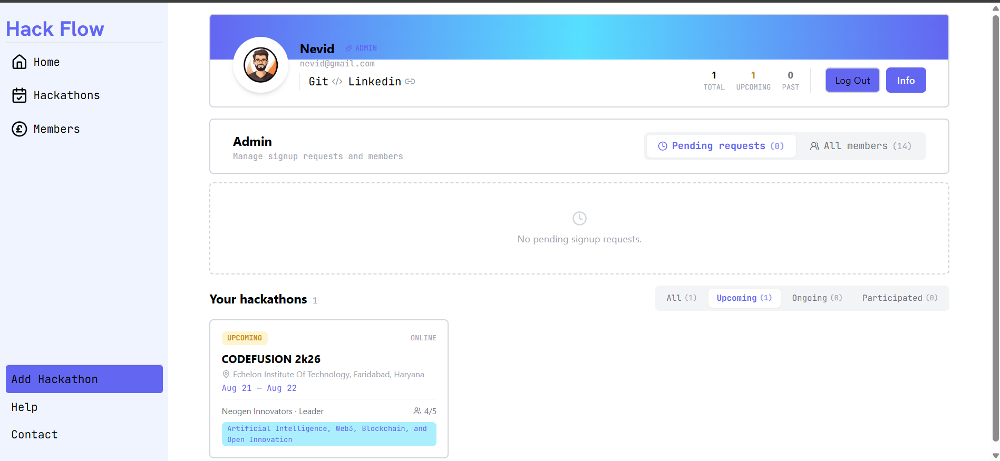
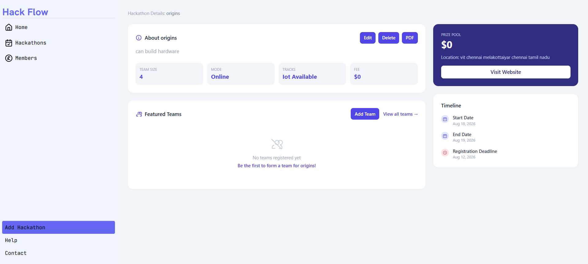
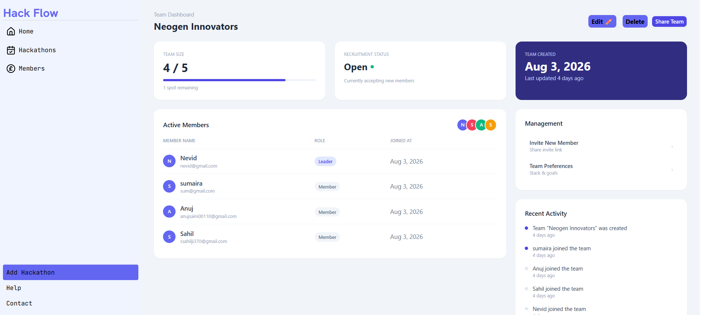
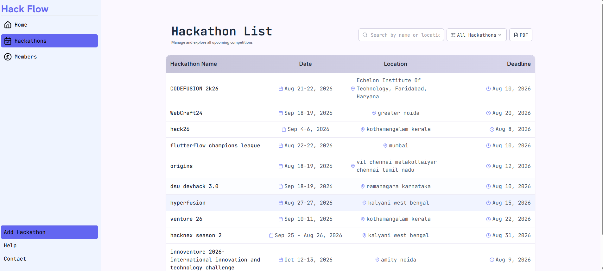

<div align="center">

# ⚡ HackFlow

**Discover. Organize. Manage. Hackathons — all in one place.**

HackFlow is a full-stack web application for discovering, organizing, and managing hackathons. Users can explore hackathons, create teams, join teams, and manage their profiles through a modern web interface.

[](https://react.dev/)
[](https://vitejs.dev/)
[](https://nodejs.org/)
[](https://expressjs.com/)
[](https://www.mongodb.com/)
[](https://www.docker.com/)

</div>

---

## 📖 Table of Contents

- [Screenshots](#-screenshots)
- [Tech Stack](#-tech-stack)
- [Prerequisites](#-prerequisites)
- [Getting Started](#-getting-started)
- [Project Structure](#-project-structure)
- [Running the Application](#-running-the-application)
- [Default Admin Account](#-default-admin-account)
- [Application URLs](#-application-urls)
- [Docker Containers](#-docker-containers)
- [Useful Docker Commands](#-useful-docker-commands)
- [Accessing MongoDB](#-accessing-mongodb-shell)
- [Features](#-features)
- [Development Workflow](#-development-workflow)
- [Stopping the Application](#-stopping-the-application)
- [License](#-license)
- [Author](#-author)

---

## 🖼️ Screenshots


<table>
  <tr>
    <td align="center" width="50%">
      <br/>
      <sub><b>Dashboard</b> — browse and discover hackathons</sub>
    </td>
    <td align="center" width="50%">
      <br/>
      <sub><b>Hackathon Details</b> — full event information</sub>
    </td>
  </tr>
  <tr>
    <td align="center" width="50%">
      <br/>
      <sub><b>Team Management</b> — create teams, invite and manage members</sub>
    </td>
    <td align="center" width="50%">
      <br/>
      <sub><b>Hackathon List</b> Know all Hackathon status: download structured pdf,filter</sub>
    </td>
  </tr>
</table>

---

## 🛠️ Tech Stack

<table>
<tr>
<td valign="top" width="33%">

**Frontend**
- ⚛️ React
- ⚡ Vite
- 🎨 Tailwind CSS
- 🧭 React Router
- 🌐 Axios

</td>
<td valign="top" width="33%">

**Backend**
- 🟢 Node.js
- 🚂 Express.js
- 🍃 Mongoose
- 🔑 JWT Authentication
- 🔒 bcrypt

</td>
<td valign="top" width="33%">

**DevOps**
- 🐳 Docker
- 📦 Docker Compose

</td>
</tr>
</table>

---

## ✅ Prerequisites

Install the following before running the project:

| Tool | Purpose |
|------|---------|
| [Docker Desktop](https://www.docker.com/products/docker-desktop/) | Container runtime |
| [Git](https://git-scm.com/) | Version control |

Verify your installation:

```bash
docker --version
docker compose version
git --version
```

---

## 🚀 Getting Started

Clone the repository:

```bash
git clone https://github.com/Nevid-786/HackFlow.git
cd HackFlow
```

---

## 📁 Project Structure

```
HackFlow
│
├── Backend
│   ├── controllers
│   ├── DB
│   ├── middleWare
│   ├── models
│   ├── routes
│   ├── Dockerfile
│   └── ...
│
├── Frontend
│   ├── public
│   ├── src
│   ├── Dockerfile
│   └── ...
│
├── docker-compose.yml
└── README.md
```

---

## ▶️ Running the Application

Make sure you're inside the project root directory.

**1. Build the Docker images**

```bash
docker compose build
```

**2. Start the application**

```bash
docker compose up -d
```

**3. Verify the containers are running**

```bash
docker ps
```

You should see three running containers:

- `hackflow-frontend`
- `hackflow-backend`
- `hackflow-mongo`

---

## 🔑 Default Admin Account

On first startup, HackFlow automatically creates an administrator account.

| Field | Value |
|-------|-------|
| Email | `admin@gmail.com` |
| Password | `admin123` |

> ⚠️ **Security note:** This account is created only if one doesn't already exist. Change the password immediately after first login, and never use these default credentials in a production deployment.

---

## 🌐 Application URLs

| Service | URL |
|---------|-----|
| Frontend | http://localhost:5173 |
| Backend API | http://localhost:3000 |
| MongoDB | mongodb://localhost:27017 |

---

## 🐳 Docker Containers

| Container | Purpose |
|-----------|---------|
| `hackflow-frontend` | React frontend |
| `hackflow-backend` | Express backend |
| `hackflow-mongo` | MongoDB database |

---

## 🔧 Useful Docker Commands

<details>
<summary><b>View running containers</b></summary>

```bash
docker ps
```
</details>

<details>
<summary><b>View logs</b></summary>

```bash
docker logs hackflow-backend
docker logs hackflow-frontend
docker logs hackflow-mongo
```
</details>

<details>
<summary><b>Restart containers</b></summary>

```bash
docker compose restart
```
</details>

<details>
<summary><b>Rebuild after code or dependency changes</b></summary>

```bash
docker compose up --build
```
</details>

<details>
<summary><b>Stop containers</b></summary>

```bash
docker compose down
```
</details>

<details>
<summary><b>Stop containers and remove MongoDB data</b></summary>

```bash
docker compose down -v
```
</details>

---

## 🗄️ Accessing MongoDB Shell

```bash
docker exec -it hackflow-mongo mongosh
```

Switch to the project database:

```javascript
use HackFlow
```

View collections:

```javascript
show collections
```

View users:

```javascript
db.users.find().pretty()
```

---

## ✨ Features

- 🔐 Secure user authentication
- 🎫 JWT access & refresh tokens
- 🛡️ Admin dashboard
- 🏆 Hackathon management
- 👥 Team creation
- ⚙️ Team management
- 👤 User profiles
- 🚧 Protected routes
- 💾 MongoDB data persistence
- 🐳 Dockerized deployment

---

## 👨‍💻 Development Workflow

Whenever Dockerfiles or dependencies change:

```bash
docker compose up --build
```

For normal development after code changes:

```bash
docker compose restart
```

---

## 🛑 Stopping the Application

Stop all running containers:

```bash
docker compose down
```

Remove containers along with MongoDB data:

```bash
docker compose down -v
```

---

## 📄 License

This project is intended for educational and personal use.

---

## 👤 Author

**Nevid Alam**

[](https://github.com/Nevid-786)

<div align="center">
<sub>Built with ❤️ using the MERN stack</sub>
</div>